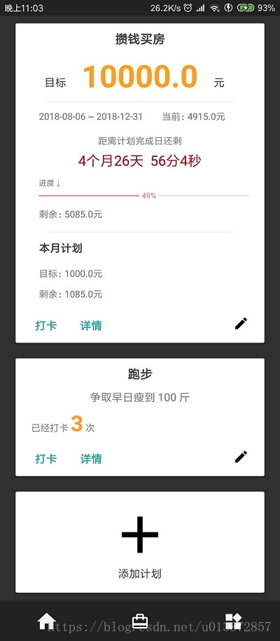

## ShiZhong
帮助制定及管理一些乱七八糟的计划，同时提供了几个并没什么用的小工具。
## 介绍
内个什么，这是一个 Android 平台的 APP，项目基于 RxAndroid+Retrofit+Glide 开发，使用MVP架构（好像大家都喜欢这么写......）。
最近经济什么的不太好大家都知道，毛衣战啊睡改啊什么的，好多公司开始裁员，跳槽跳不动（主要是我太菜了），尤其是我们小安卓，再加上异教徒前端一晚上一个的框架的冲击，感觉都要失业了。

然后我就想着要攒钱娶媳妇，这种环境下最应该做的就是好好攒钱，天天向上，高筑墙广积粮，但是攒钱说起来简单做起来和其容易呢，一个月就那点工资，买几个游戏就没了，只能靠着加班做外快才能维持得了生活这样子。
我就想如果能有一个 APP，输入攒钱目标能自动计算出来每个月要攒多少钱啊，如果把每花一笔钱都记上去还能计算当月还能花多少钱，这个月花的少了下个月就得多攒点，再加上统计图表什么乱七八糟的，那岂不是很棒，于是这个看起来并没什么卵用的 APP “砰”的一声就出来了，另外还有一些同样没什么卵用的小工具，比如查看 wifi 密码啊什么的，反正我是没怎么用过，不过确实挺好（sha）用（bi）的。
反正开源嘛，代码写得好就行了（哪里好了？？？），我也不准备靠这个升官发财出任白富美，你们能去 gayhub 给我点个 star 我就给您磕头了。不 bb 了，先看一下这个吊炸天的 APP 截图。
## 截图

这个是首页，用来显示计划列表，看起来还不错吧，我设计了好久呢，感觉可以做产品经理了。

这个是定量计划的详情，我在 Material Design 官网上学（抄）的，一个买家秀一个卖家秀。

这个是打卡计划的详情页面，配色真的好难调啊我怎么知道怎么调好看！就这样吧爱咋滴咋滴，反正老子自己做的APP！我连安卓4.4都不兼容！硬气！自己做的 APP 就是任性！

这个是 TODO 列表（市面上有一万个做 TODO 的 APP。。。），根据时间的紧急度做了颜色渐变，有没有一种夕阳西下，枯藤老树昏鸦的感觉？？？真好看。

其实真的没啥好设置的，就这么一个破 APP 能设置啥，新版本检测功能都没有，辣鸡，不过那个切换日间/夜间的功能还行，我花了好久才做出来了，你们一定要用一下，不要辜负我的一片苦心，要是发现啥 bug 就当做没看到好了。仿照酷安的，但是没人家的流畅哎，可能时间没设置好，不过这不重要，反正没几个人会真的用，对了，狂点右下角按钮有惊喜（惊喜个屁）。

## 技术点
这个破 APP 也没啥技术难点，挺简单的反正。 
用的是 MVP 架构（真麻烦），里面也有几个 HTTP 接口，用的 RxAndroid+Retrofit，这俩加起来是真的好用，但是 Retrofit 的 baseURL 设置之后就不能更改，这个不太好我觉得，好在网上有很多解决方案，搜一下就有。
数据库 ORM 用的是 GreenDao。
代码总共也不多，写的还算是挺整洁的，注释啥的都有。

## 地址
我上架到酷安了，别的没上传，太麻烦了，国内一堆的市场。

酷安地址：
https://www.coolapk.com/apk/199335

另外 APK 我也传到 Github 上了（记得点 star 啊）：

https://github.com/0xZhangKe/ShiZhong

还有啥问题欢迎给我提 issue，我会尽力改的。
